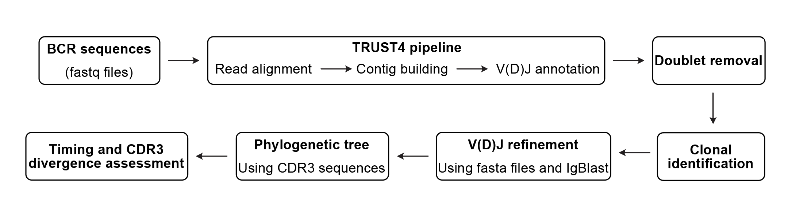

# Single-Cell VDJ processing

The B cell receptor (BCR) and T cell receptor (TCR) are antigen-recognition receptors of the adaptive immune system. BCRs recognize antigens directly through membrane-bound immunoglobulins, whereas TCRs recognize peptide antigens presented by major histocompatibility complex (MHC) molecules. Both receptors achieve extraordinary diversity through V(D)J recombination during lymphocyte development, enabling precise and robust immune responses.

This repository contains code for:

### BCR processing steps:

1. Generating BCR Repertoire using TRUST4
1. Removing the Doublets using BCR sequences
1. Detecting the dominant clone
1. Refining the V/D/J assignments in Hodgkin and Reed-Sternberg (HRS) cells
1. Building the phylogenetic tree

The general scheme is illstrated below - More details about the steps are provided in the workflow folder.

<div align="left">
  
</div>

More details about the steps are provided in the workflow folder.


## Requirements

The following packages are required to be installed prior to running the pipeline:
1) TRUST4 (https://github.com/liulab-dfci/TRUST4) [1]
2) igblast (https://ncbi.github.io/igblast/cook/How-to-set-up.html) [2]
3) IgPhyML (https://github.com/immcantation/igphyml) [3, 4]
4) R (4.4.2)
    - <span style="color:red;">Ape</span> ()


### Generating BCR Repertoire using TRUST4

BCR repertoire is generated from BCR single cell fastq files using TRUST4 as follows:
```bash
chmod +x run_trust4_slurm.sh
sbatch run_trust4_slurm.sh <sample_name> <read1.fastq.gz> <read2.fastq.gz> <output_prefix>
```

TRUST4 generates multiple output files in `/path/to/trust4_output_dir/` including cdr3.out, which contains the CDR3 sequences.

Incomplete CDR3 sequences are then filtered out using the following command:

```bash
cd /path/to/trust4_output_dir/
python trust-cluster.py /path/to/trust4_output_dir/cdr3.out /path/to/trust4_output_dir/cluster_clone.tsv
```

The outcome file (cluster_clone.tsv) is used for more downstream analysis and generating the BCR phylogenetic tree.

### Removing the Doublets using BCR sequences

Doublets were identified based on the principle of allelic exclusion using the following command.
> `cell_metadata.csv`: four column table with cell barcode ("Full.cell_id") and cell type ("MainCelltype"), sub-cell type ("SubtypeName) and patient ID ("Patient")
Example `cell_metadata.csv`:
<details>
  <summary>See `cell_metadata.csv` example</summary>
| Full.cell_id | MainCelltype | SubtypeName | Patient |
|---|---|---|---|
| AAACGGGCAAAGTGCG | HRS | State1 | Sample1 |
| AAACGGGCAGTCAGAG | HRS | State2 | Sample1 |
| AAACGGGGTATCAGTC | HRS | State1 | Sample1 |
| AAAGATGGTTGGTTTG | HRS | State3 | Sample1 |
| AAAGCAAAGTGGTAGC | HRS | State1 | Sample1 |
| AAATGCCTCTCTGTCG | HRS | State4 | Sample1 |
| AACGTTGGTAAGTTCC | HRS | State1 | Sample1 |
| AACTGGTCAAACGTGG | HRS | State2 | Sample1 |
| AACTGGTTCTGCTGTC | HRS | State1 | Sample1 |
</details>

```bash
Rscript scripts/BCR/doublet_finding_BCR.R \
  --input /path/to/trust4_output_dir \
  --metadata /path/to/cell_metadata.csv \
  --sample Sample1 \
  --file /path/to/cdr3.out

```

This command runs the BCR doublet detection using TRUST4 output and associated metadata.

### Refining the V/D/J assignments in Hodgkin and Reed-Sternberg (HRS) cells

This step uses the igblast tool and fasta file as extra resources to survive the HRS cells with different V,D,J from the dominant clone.
To run this part, a list of HRS contigs are required, based on this pattern "contigs_${sample}_${chain}.txt".

For example, we subset the HRS contigs in "contigs_HL1_IGL.txt". IGL is  the clonal chain.

```bash
AAACGGGCAAAGTGCG_21556
AAACGGGCAGTCAGAG_21980
AAACGGGGTATCAGTC_21656
AAAGATGGTTGGTTTG_22094
AAAGCAAAGTGGTAGC_21648
AAATGCCTCTCTGTCG_21695
AACGTTGGTAAGTTCC_21525
AACTGGTCAAACGTGG_22089
AACTGGTTCTGCTGTC_21948

```
This file should be saved to the directory that *annot.fa (output from trust4) is located.
Then we should run submit_igblast.sh:

```bash
chmod +x igblast_preprocess.sh
./igblast_preprocess.sh <sample> <clone_chain> <path to *annot.fa file as an output of TRUST4>
```

Here is an example: 
```bash
./igblast_preprocess.sh HL1 IGL /athena/namlab/scratch/sam4032/HL1_s1s2/HL1_T4_Output_2024_01_04
```
After running igblast, refining_VDJ_BCR.R is run. 


### Building the phylogenetic tree

To generate the phylogenetic tree, IgPhyML package is used. To install it, please refere to: https://igphyml.readthedocs.io/en/latest/install.html
The input of igphyml is generated from  running heatmap_after_VDJcorrection.R and  then IgPhyML_fasta_prepration.R. 
After installation, copy you CDR3_preprocessed_MAFFT_aligned.fa to your working directory and run the below script:

```bash
sbatch igphyml_run.sh HL1
```
make sure that igphyml_run.sh is modifed based on the directory where igphyml is installed.
you can interactively run the IgPhyML if the number of CDR3 sequences is low. Here is an example:

```
sample=HL1
/athena/namlab/scratch/sam4032/CDR3_tree/igphyml/src/igphyml \
 -i /athena/namlab/scratch/sam4032/CDR3_tree/singleCDR3/$sample/sampled_unique_sequences_${sample}.fasta \
 -m GY \
 --run_id singleCDR3_$sample
```
The igphyml tree downstream anlysis will be then performed by running igphyml_downStream.R. 

References
----------

1. Song L, Cohen D, Ouyang Z, Cao Y, Hu X, Liu XS. TRUST4: immune repertoire reconstruction from bulk and single-cell RNA-seq data. Nat Methods. 2021;18(6):627-630. doi:10.1038/s41592-021-01142-2.

2. Ye J, Ma N, Madden TL, Ostell JM. IgBLAST: an immunoglobulin variable domain sequence analysis tool. Nucleic Acids Res. 2013;41(W34–40). doi:10.1093/nar/gkt382.

3. Hoehn KB, Lunter G, Pybus OG. A Phylogenetic Codon Substitution Model for Antibody Lineages. Genetics. 2017;206(1):417–427. https://doi.org/10.1534/genetics.116.196303

4. Hoehn KB, Vander Heiden JA, Zhou JQ, Lunter G, Pybus OG, Kleinstein SH. Repertoire-wide phylogenetic models of B cell molecular evolution reveal evolutionary signatures of aging and vaccination. bioRxiv. 2019. https://doi.org/10.1101/558825
EOF


For TCR: 
```bash
Rscript scripts/BCR/doublet_finding_TCR.R \
  --input /path/to/trust4_output_dir \
  --metadata /path/to/cell_metadata.csv \
  --sample HL1 \
  --file /path/to/HL1_cdr3.out

```

